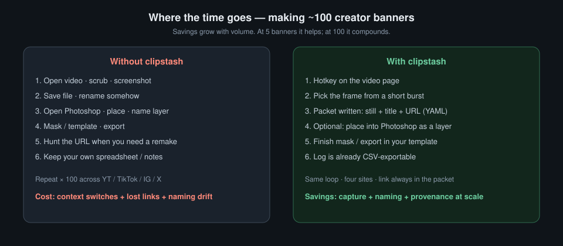

# Case study: clipstash for creator banner batches

**clipstash** is a Chrome-first tool that saves a **video still + title + source URL** as one reusable packet. This note is the product story: a real job (promotional banners for a creator across their social accounts), what hurts without a tool, and what the public extract keeps.

Public repo: [eriksjaastad/clipstash](https://github.com/eriksjaastad/clipstash).  
Companion plan: [PLAN.md](./PLAN.md). Known limits and deferred ideas: [ISSUES.md](./ISSUES.md).



*Top: push MAKE (the hotkey). Bottom: write it down, again and again. Create banner (−) is the same later either way.*

---

## The job

You are tasked with making a bunch of promotional banners for a creator. You need to go through their videos — often across **YouTube, TikTok, Instagram, and Twitter/X** — pick usable frames, drop them into a Photoshop template (layer masks, layout), export finished banners, and keep a reliable log of what you used and where it came from.

That is not a one-off screenshot. It is a **batch** job. The more you have to make, the more the friction matters. Making five is mildly annoying. Making a hundred per category is where a purpose-built loop pays for itself.

---

## Without the tool

1. Find the video
2. Take a screenshot
3. Screenshot lands wherever the OS put it
4. Drag the file into Photoshop
5. Create banner (−)
6. Export
7. Type the name when you save (into the folder you already set up)
8. Paste the image name into Excel
9. Copy the video page URL and paste that into Excel too

Repeat across YouTube, TikTok, Instagram, and Twitter/X — and across dozens or hundreds of videos. The slow part is not the creative work. It is everything around it.

---

## With clipstash

The hotkey does the paperwork: saves the still with a usable name, writes the YAML (title, URL, and the rest), and keeps a log you can walk later. You can batch a pile of captures first, then come back and do all the marketing / Photoshop work in a separate pass.

Capture pass (good when you can pause on the frame you want):

1. Open the video URL
2. Hotkey → still saved, named/organized, recorded in YAML

Later (when you are ready to make banners):

3. Create banner (−) — open the stills (or optional Photoshop place) and do the image work
4. Export

Create banner is the same either way (−). What the tool removes on the capture pass is screenshot filing, naming, and the Excel name/URL bookkeeping. Fast, and self-documenting.

**Optional:** burst / bracket frames around the pause when the moment is hard (blink, mid-motion). Not required when the pause is already right — short clips often are. Case study default is the hotkey path; burst is the extra. Photoshop place is optional too — handy if you want the still dropped into a doc during capture, not required if you batch screenshots first.

Clipboard history in the extension is a convenience. The **packet** is the source of truth:

```text
~/Clipstash/packets/<site>/<id>/
  <slug>.png    # slugified video title (or popup type-in override)
  record.yaml   # title, URLs, site, image/name, capture_method, timestamp, …
```

Site adapters (YouTube, X, Instagram, TikTok, plus a generic fallback) own title and URL for each site. Capture code owns the still.

---

## Why volume is the point

At five banners, the tool saves some time. At a hundred per category, the filing and spreadsheet steps are what would have burned the day — and those are exactly what the hotkey removes.

We used this kind of tool on large assignments. The point is not a prettier screenshot. It is still + title + URL written down for you, every time, so remakes and exports are not a scavenger hunt.

---

## Architecture that survived the extract

```text
Chrome extension (MV3)
  adapters → capture / burst → clipboard history
        │
        ▼  localhost HTTP
Local helper (clipstashd)
  write packets · burst picker · CSV · optional Photoshop
```

Why a helper? Browser canvas capture is fast when it works, but cross-origin `<video>` (common on YouTube) taints the canvas. Prefer media-native frames (download/decode + ffmpeg) when you can; keep a visible-tab + crop fallback when you cannot. Disk write and a multi-frame picker are cleaner outside the extension process.

v1 capture ladder:

| Path | When |
|------|------|
| In-page canvas | Untainted `<video>` draw |
| Helper ffmpeg burst | Tainted burst: fetch media → ±7 × 0.15s PNGs → picker |
| Visible-tab + crop | Fallback: full-tab shot cropped to the video’s on-screen rect |

Install aims at “boring for strangers”: Homebrew formula and/or a local PyInstaller binary plus LaunchAgent. We are **not** joining the Apple Developer Program or notarizing downloadables; brew/source (and local unsigned builds) are the supported paths.

---

## What we deliberately left behind (and what is next)

| Left in private / deferred | Why |
|----------------------------|-----|
| Style / face scoring gates | Tuned to one corpus; not the packet product |
| Catalogue numbering / finish export directories | Client ops; public v1 stops at packet + optional place |
| Review dashboard / timed links | Client delivery surface |
| Real captures, sheets, worklists | Never publish |
| Windows/Linux helper parity | macOS first |
| Chrome Web Store polish | Sideload docs first |

**On the product backlog (idea pile → cards):**

- ~~Web-safe still / layer names (adapter defaults for the four sites + optional type-in we always slugify).~~ Landed: `helper/slug.py` + popup "Still name" field; stills are `<slug>.png`.
- ~~Packets organized by **site folder** (e.g. YouTube/…) with stills named from the **video title** (web-safe), so a folder listing is readable and the YAML still holds the page URL for remakes.~~ Landed: packets live at `~/Clipstash/packets/<site>/<id>/`.
- Export polish around that YAML → CSV / spreadsheet story.
- ~~Creator video-grid overlay: **green check** on thumbnails already in the packet log (huge when you are making ~100 per category — we had a version of this in the original private tool).~~ Landed (#7691): green check on YouTube / TikTok / Instagram grid thumbs, matched by canonical URL against `GET /packets`; X/Twitter stays out of scope.

The extract rule that kept us honest: **rewrite for the packet model; do not scrub-and-push the private tree.** Then grow the public tool toward the batch workflow the case study describes.

---

## How it was built (short)

- Plan and board first (`PLAN.md`, Kanban), then a public empty repo and synthetic demo packets only.
- Slices shipped as small PRs: schema → extension + history → adapters → burst picker → Photoshop → install → polish.
- Coding seat: local DeepSeek as Worker under a stronger orchestrator; no Cursor cloud for implementation. Behaviour docs live next to code with drift-guard tests; markdown keeps the why/how story.

The product lesson: **end a client job by naming the transferable object** (here, the packet), rewrite around it, leave engagement-specific machinery in the archive, and let volume — not novelty — justify the next features.

---

## What “done” looks like for v1

- Packets on disk with stable records and CSV export
- Four site adapters + generic fallback
- Clipboard history in the extension
- Burst + picker, including ffmpeg path for cross-origin video
- Optional macOS Photoshop place with clear automation errors
- Homebrew / single-binary install story
- MIT license, public GitHub, no client data in tree

v1 is the capture + packet core. Site folders, title-slug still names, and the green-check grid overlay have shipped; remaining “banner factory” follow-on work (richer export) stays on the backlog — update the code to match this case study as those cards ship.

---

## If you are extracting your own tool

1. Write the one-line **job** before you copy files (ours: batch creator banners across social video).
2. Name the source-of-truth artifact (ours is the packet folder + record).
3. Draw a hard “never publish” list on day one.
4. Prefer adapters and capture modes you can explain in a table over a monolith grab script.
5. Ship a stranger install path before you polish platform edge cases (TCC, Store). Skip paid Apple notarization unless you need downloaded prebuilts.
6. Optimize for the **hundredth** capture, not the demo of five.

clipstash exists because the client work ended — and because the still + title + URL habit did not.
